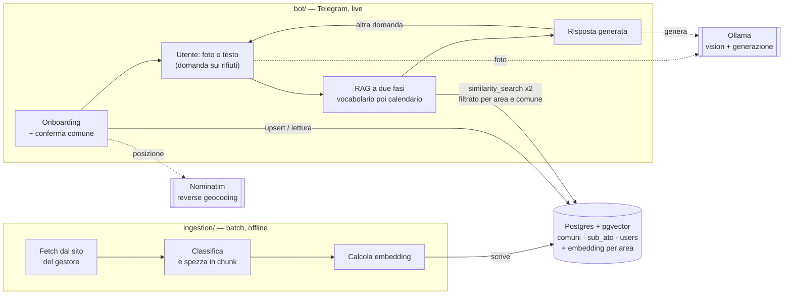

# bordeus

Un bot Telegram che ti dice come buttare la spazzatura in Valle
d'Aosta. Gli mandi la foto di un oggetto (o lo descrivi a parole) e lui
ti dice in che bidone va usando le guide ufficiali del gestore rifiuti del tuo comune.
Risponde nella lingua che usi (italiano, francese, inglese, spagnolo o tedesco).

> **Perché "bordeus"?** È la parola per "spazzatura" più diffusa nel
> patois valdostano (francoprovenzale) — confermata dal
> [dizionario ufficiale del francoprovenzale](https://www.patoisvda.org/it/).
> _"Campà ià lo bordeus"_ significa "buttare la spazzatura" (fr. _jeter les ordures_).

L'idea nasce da un problema banale ma comune: capita spesso di non
essere sicuri di come buttare qualcosa, e cercare la risposta giusta —
tra volantini, siti dei gestori, calendari stampati appesi in cucina —
richiede più tempo di quanto vorresti. Ti servirebbe solo un modo
veloce per chiedere e avere una risposta. In Valle d'Aosta la cosa si
complica ulteriormente: dal 2024 la regione è divisa in 5 aree di
gestione rifiuti (i "Sub-ATO"), ciascuna con un gestore diverso e le sue
regole.
Il bot fa il lavoro noioso al posto tuo: capisce di quale comune parli,
recupera le informazioni giuste dalle guide ufficiali di quel gestore
con un RAG (Retrieval-Augmented Generation) e ti risponde.

Costruito interamente con strumenti **open source** — LangChain,
Postgres/pgvector, modelli Hugging Face per gli embedding, Ollama per
far girare l'LLM in locale — niente servizi a pagamento, niente
dipendenze da API commerciali.

> ⚠️ **Non è pronto per un uso in produzione.** L'ho sviluppato e
> testato con modelli eseguiti in locale su una GTX 1080 (la scheda che
> ho nel mio desktop) — con questa potenza di calcolo, cose come una
> valutazione RAG più seria (richiederebbe ore di esecuzione) o un
> query reranking (un passaggio in più prima di ogni risposta) non sono
> praticabili senza far diventare i tempi di risposta del bot
> inaccettabili. Vedi "Sviluppi futuri" più sotto per i dettagli su
> cosa manca.



Progetto interamente **Python**, organizzato come workspace `uv` con tre
componenti:

- **`common/`** — codice condiviso tra ingestion e bot: schema/accesso
  dati (aree Sub-ATO, comuni, `users`), il wrapper del modello di
  embedding e la scrittura/lettura del vector store. Vedi
  `common/README.md`.
- **`ingestion/`** — pipeline batch/offline: scarica le guide dei
  gestori, le classifica per categoria (anche dal contenuto dei PDF, non
  solo dal nome file), le carica (`BSHTMLLoader`/`PDFPlumberLoader`/
  `TextLoader`, LangChain), le spezza in chunk con LangChain, calcola gli
  embedding con un modello Hugging Face e scrive su Postgres/pgvector
  tramite `langchain-postgres`. Vedi `ingestion/README.md`.
- **`bot/`** — il bot Telegram vero e proprio: onboarding del comune
  con conferma esplicita dell'area/gestore risolto, identificazione
  dell'oggetto da una foto (vision via Ollama), risposta RAG sulle guide
  di smaltimento (retrieval sullo stesso vector store scritto
  dall'ingestion, generazione via Ollama). Vedi `bot/README.md`.

`ingestion/` e `bot/` condividono un solo schema Postgres (le tabelle
`sub_ato`, `comuni` e `users`, in `migrations/`, l'unica fonte di
verità — vedi "Aree Sub-ATO" più sotto) e lo stesso `Embeddings`/
`PGVector` (entrambi in `common/`, non duplicati né presi in prestito
l'uno dall'altro) — un solo linguaggio, un solo spazio vettoriale,
niente da tenere sincronizzato tra due implementazioni diverse.

## Aree Sub-ATO: embedding raggruppati per area, non per comune

Un gestore può servire **più aree con contenuti diversi** — es. Quendoz
gestisce sia il Sub-ATO C (Aosta) sia il D (Mont-Cervin ed Évançon), con
pagine guida separate. L'**area**, non il gestore, è quindi la chiave
giusta per raggruppare gli embedding (`collection_name = area_id`):
più comuni della stessa area condividono la stessa collection invece di
duplicare gli stessi chunk per ciascuno. Un comune eredita l'area (e
quindi il gestore) a cui appartiene, non ne ha uno proprio.

Non tutto il contenuto di un'area è però davvero condiviso da tutti i
comuni che la compongono: il calendario di raccolta porta a porta, ad
esempio, può variare da un comune all'altro della stessa area per
motivi logistici, anche sotto lo stesso gestore. Questo contenuto resta
nella stessa collection dell'area ma taggato con il comune specifico —
il bot filtra automaticamente in fase di retrieval (contenuto condiviso
PIÙ quello del comune dell'utente, mai quello di un comune vicino).

Il bot chiede conferma esplicita dell'area/gestore risolto prima di
completare l'onboarding (bottoni Sì/No) — vedi `bot/README.md`.

Dettagli completi (schema, CLI multi-URL, classificazione PDF dal
contenuto) in `ingestion/README.md`.

## Stato attuale

- **Ingestion**: dato l'URL (o gli URL) di un'area di gestione rifiuti,
  scarica pagina HTML e i PDF/Markdown linkati in una cartella locale
  `knowledge/<area_id>/<categoria>/` (categoria stimata
  automaticamente anche dal contenuto dei PDF, non solo dal nome file),
  li carica con i loader di LangChain, li spezza in chunk
  (`RecursiveCharacterTextSplitter`/`MarkdownTextSplitter`) e li scrive
  su Postgres con embedding calcolati da
  `microsoft/harrier-oss-v1-0.6b` (1024 dimensioni, configurabile via
  `EMBEDDING_MODEL`). Un'area può avere più fonti e più comuni:
  l'ingestion fa l'INSERT/UPSERT di area e comuni lei stessa, non serve
  crearli prima a mano. Include un notebook con visualizzazione t-SNE
  (2D/3D) e un test del retriever.
  - **Persistenza**: `sub_ato`/`comuni`/`users` su Postgres (schema
    condiviso, `migrations/`). La knowledge base RAG (chunk con embedding)
    è su Postgres/pgvector con lo schema gestito da `langchain-postgres`
    (una collection per **area Sub-ATO**, non per comune).
- **Bot**: onboarding con conferma, foto → identificazione oggetto
  (Ollama, multimodale) → RAG (retriever sull'area Sub-ATO del comune
  dell'utente, con filtro per comune specifico) → risposta generata
  (Ollama). Tutto — messaggi statici del bot e risposte generate
  dall'LLM — disponibile in italiano, francese, inglese, spagnolo e
  tedesco, in base alla lingua del client Telegram dell'utente. Vedi
  `bot/README.md` per i dettagli.

## Estendibilità multi-area/multi-comune

- `area_id` (l'identificativo del Sub-ATO) è esplicito ovunque (metadata dei
  chunk, collection del vector store) — i dati di aree diverse non si
  mescolano mai, anche condividendo lo stesso gestore;
- un'area si aggiunge lanciando la pipeline di ingestion sulla sua
  fonte (`uv run bordeus-ingest --sub-ato=id:Nome --gestore=... --url=... --comune=id:Nome`,
  vedi `ingestion/README.md`) — fa lei l'INSERT/UPSERT di area e comuni,
  il bot li vede subito, non serve riavviarlo né configurarlo;
- una singola area può avere più fonti (`--url`, ripetibile — tipico:
  una pagina specifica dell'area + un contenuto condiviso da tutte le
  aree dello stesso gestore, come un vocabolario) e più comuni
  (`--comune`, ripetibile);
- se un comune ha contenuto non condiviso con gli altri comuni della sua
  area (tipicamente un calendario di raccolta), si aggiunge con
  `--comune-url=id:url`.

## Setup locale (gratuito)

Richiede [uv](https://docs.astral.sh/uv/), Postgres con `pgvector`, e
[Ollama](https://ollama.com) in esecuzione con un modello multimodale
scaricato (es. `ollama pull gemma3:4b` o un modello equivalente con
supporto immagini — qualunque, basta configurarne il nome).

1. **Postgres**: `docker compose -f deployment/docker-compose.yml up -d`
   (immagine ufficiale `pgvector/pgvector`).
2. **Bot Telegram**: crea un bot con
   [@BotFather](https://t.me/BotFather) e copia il token.
3. **Ingestion** — popola almeno un'area prima di avviare il bot
   (nessuna area, nessuna risposta utile):

   ```bash
   cd ingestion
   cp .env.example .env   # DATABASE_URL, opzionalmente EMBEDDING_MODEL
   uv sync
   uv run bordeus-ingest --sub-ato=sub-ato-e:"Sub-ATO E — Mont-Rose e Walser" \
            --gestore="TeknoService Italia" \
            --url=https://www.teknoserviceitalia.com/guide \
            --comune=donnas:Donnas \
            --comune-url=donnas:https://www.teknoserviceitalia.com/valle-daosta/donnas/
   ```

4. **Bot**:

   ```bash
   cd bot
   cp .env.example .env   # TELEGRAM_BOT_TOKEN, stesso DATABASE_URL, OLLAMA_*
   uv sync
   uv run bordeus-bot
   ```

`uv sync --all-packages` lanciato dalla radice installa tutti e tre i
membri (`common`, `ingestion`, `bot`) in un solo venv condiviso — comodo
per lavorare su più parti contemporaneamente. **Attenzione**: `uv sync`
lanciato dalla radice _senza_ `--all-packages` non installa nulla dei
membri (il progetto radice non ha dipendenze proprie, è solo il
contenitore del workspace) — va lanciato dentro una sottocartella, o con
`--all-packages`/`--package <nome>` dalla radice.

Il bot usa **long-polling**, quindi non serve alcun hosting pubblico:
gira sulla tua macchina, si connette lui a Telegram.

## Struttura

```plaintext
.
├── bot
│   ├── notebooks
│   │   └── rag_eval.ipynb
│   ├── src
│   │   └── bordeus_bot
│   │       ├── config.py
│   │       ├── geocode.py
│   │       ├── i18n.py
│   │       ├── identify.py
│   │       ├── __init__.py
│   │       ├── rag.py
│   │       └── telegram_bot.py
│   ├── pyproject.toml
│   └── README.md
├── common
│   ├── src
│   │   └── bordeus_common
│   │       ├── db.py
│   │       ├── embed.py
│   │       ├── __init__.py
│   │       └── vectorstore.py
│   ├── pyproject.toml
│   └── README.md
├── deployment
│   └── docker-compose.yml
├── ingestion
│   ├── assets
│   │   └── PXL_20260813_144520511.jpg
│   ├── notebooks
│   │   ├── ingest.ipynb
│   │   ├── obj_identification_test.ipynb
│   │   └── pdf_read_test.ipynb
│   ├── scripts
│   │   └── ingest_donnas.sh
│   ├── src
│   │   └── bordeus_ingest
│   │       ├── chunk.py
│   │       ├── classify.py
│   │       ├── fetch.py
│   │       ├── __init__.py
│   │       ├── knowledge.py
│   │       ├── loaders.py
│   │       ├── pipeline.py
│   │       └── viz.py
│   ├── pyproject.toml
│   └── README.md
├── migrations
│   ├── 0001_init.sql
│   └── 0002_sub_ato.sql
├── LICENSE
├── pyproject.toml
├── README.md
└── uv.lock
```

## Note tecniche

- **GPU (NVIDIA GTX 1080)**: `torch` è pinnato `<2.8` con indice CUDA
  12.6, dichiarato come dipendenza diretta in `common/pyproject.toml`
  (l'override di sorgente in `pyproject.toml` root si applica in modo
  affidabile solo dove `torch` è dipendenza diretta di almeno un membro).
  `ingestion/` e `bot/` lo ricevono transitivamente via
  `bordeus-common`, garantendo che tutti e tre risolvano esattamente la
  stessa build (importante: build diverse di `torch` potrebbero produrre
  embedding non identici a parità di modello). Le GPU Pascal hanno perso
  il supporto nelle build PyTorch ≥2.8. Dettagli nei commenti di
  `pyproject.toml` (root) e `common/pyproject.toml`. Con una GPU più
  recente, aggiorna semplicemente il pin e l'indice.
- **Caricamento documenti**: `ingestion/` usa `BSHTMLLoader`
  (BeautifulSoup) per l'HTML e `PDFPlumberLoader` (`pdfplumber`) per i
  PDF — solo estrazione di testo, non conversione a Markdown
  strutturato. Scelta deliberata: alternative come
  [Docling](https://github.com/docling-project/docling) richiedono
  incondizionatamente `torch`+`torchvision`+`docling-ibm-models` anche
  solo per l'import, un costo che non si giustifica per PDF generati
  digitalmente dai gestori (non scansioni), dove l'estrazione di testo
  piatto è comunque sufficiente. Dettagli in `ingestion/README.md`.
- **Modello di embedding**: `microsoft/harrier-oss-v1-0.6b`, decoder-only
  con last-token pooling, 1024 dimensioni. Le **query** vanno prefissate
  con un'istruzione in linguaggio naturale (gestito in `bot/rag.py`,
  `QUERY_INSTRUCTION`, applicata da
  `bordeus_common.embed.get_embeddings(query_instruction=...)`), i
  **documenti** no — l'ingestion non ne ha bisogno.
- **Schema condiviso**: le migrazioni in `migrations/` (`0001_init.sql`
  - `0002_sub_ato.sql`) sono applicate sia da `ingestion/` sia da `bot/`
    con lo stesso meccanismo di tracking (`schema_migrations`), tutte in
    ordine — indifferente quale dei due parta per primo (anche se in
    pratica va lanciata prima l'ingestion, altrimenti il bot non ha
    comuni da servire).
- **Nominatim**: `geocode.default_user_agent` in `bot/` usa un contatto
  placeholder — sostituiscilo con un contatto reale prima di un uso
  oltre la demo occasionale, come richiesto dalla policy d'uso di
  Nominatim.

## Sviluppi futuri

Questa prima pubblicazione copre il flusso RAG di base (ingestion →
retrieval a due fasi vocabolario+calendario → generazione) più un primo
giro di valutazione/ingegnerizzazione del system prompt
(`bot/notebooks/rag_eval.ipynb`). Alcuni miglioramenti rimandati
deliberatamente a una fase successiva:

- **Copertura completa delle 5 aree Sub-ATO**: il progetto è stato
  validato su aree e comuni di esempio — serve un giro di ingestion
  reale su tutte le aree e i rispettivi comuni della Valle d'Aosta
  perché il bot sia utile a chiunque, non solo a chi vive nelle aree
  già popolate.
- **Ingestion manuale per contenuti difficili da estrarre**: alcune
  informazioni (eccezioni, casi particolari non documentati in una
  pagina web, correzioni a contenuti classificati male) potrebbero
  richiedere un modo per inserire chunk "a mano" nella knowledge base,
  non solo tramite fetch da URL.
- **Valutazione RAG più sistematica**: `rag_eval.ipynb` oggi confronta
  varianti di prompt a occhio, con controlli automatici solo euristici
  (risposta non vuota, non un eco della domanda, ecc.). Un passo
  naturale successivo è un set di domande con risposte di riferimento
  scritte a mano, e metriche più rigorose (recall@k del retrieval, un
  LLM-as-judge per la correttezza della risposta contro il riferimento)
  invece della sola lettura manuale.
- **Query reranking**: il retrieval oggi si ferma alla similarità
  coseno via `pgvector` — un reranker (es. un cross-encoder applicato ai
  top-k risultati prima di costruire il prompt) potrebbe migliorare la
  precisione, soprattutto quando la ricerca iniziale restituisce chunk
  solo genericamente pertinenti.
- **Test automatici**: la validazione fin qui è stata soprattutto
  manuale contro Postgres reale durante lo sviluppo — manca una suite
  di test automatizzata (`pytest`) da eseguire in CI.
- **Deployment più robusto**: il bot gira oggi in long-polling su una
  singola macchina — per un uso pubblico continuativo servirebbe
  un deployment containerizzato/monitorato (o il passaggio
  a webhook), oltre a una qualche forma di rate limiting.

## Licenza

[MIT](LICENSE).
