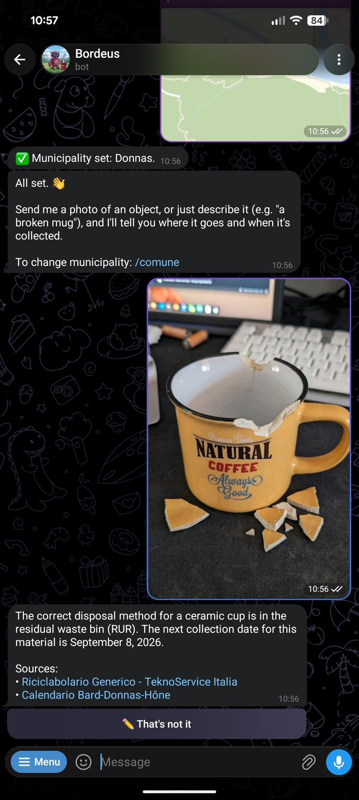
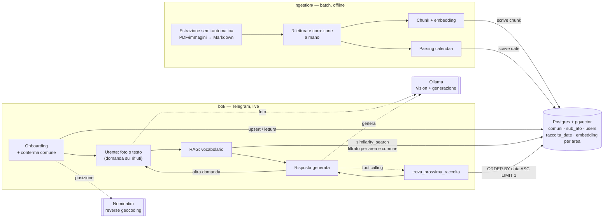

# bordeus

[](https://github.com/mattemindev/bordeus/actions/workflows/ci.yml)

Un bot Telegram che ti dice come buttare la spazzatura in Valle
d'Aosta. Gli mandi la foto di un oggetto (o lo descrivi a parole) e lui
ti dice in che bidone va usando le guide ufficiali del gestore rifiuti del tuo comune.
Risponde nella lingua che usi (italiano, francese, inglese, spagnolo o tedesco).

> **Perché "bordeus"?** È la parola per "spazzatura" più diffusa nel
> patois valdostano (francoprovenzale) — confermata dal
> [dizionario ufficiale del francoprovenzale](https://www.patoisvda.org/it/).
> _"Campà ià lo bordeus"_ significa "buttare la spazzatura" (fr. _jeter les ordures_).

L'idea nasce da un problema banale ma comune: capita spesso di non
essere sicuri di come buttare qualcosa, e cercare la risposta giusta —
tra volantini, siti dei gestori, calendari stampati appesi in cucina —
richiede più tempo di quanto vorresti. Ti servirebbe solo un modo
veloce per chiedere e avere una risposta. In Valle d'Aosta la cosa si
complica ulteriormente: dal 2024 la regione è divisa in 5 aree di
gestione rifiuti (i "Sub-ATO"), ciascuna con un gestore diverso e le sue
regole.
Il bot fa il lavoro noioso al posto tuo: capisce di quale comune parli,
recupera le informazioni giuste dalle guide ufficiali di quel gestore
con un RAG (Retrieval-Augmented Generation) e ti risponde.

Costruito interamente con strumenti **open source** — LangChain,
Postgres/pgvector, modelli Hugging Face per gli embedding, Ollama per
far girare l'LLM in locale — niente servizi a pagamento, niente
dipendenze da API commerciali.

<p align="center">
  
</p>

Esempio di interazione con il bot. Il bot indica la corretta modalità di smaltimento,
anche il giorno di raccolta, e cita le pubblicazioni del gestore da cui viene
la risposta.

> ⚠️ **Non è pronto per un uso in produzione.** L'ho sviluppato e
> testato con modelli eseguiti in locale su una GTX 1080 (la scheda che
> ho nel mio desktop) — con questa potenza di calcolo, cose come una
> valutazione RAG più seria (richiederebbe ore di esecuzione) o un
> query reranking (un passaggio in più prima di ogni risposta) non sono
> praticabili senza far diventare i tempi di risposta del bot
> inaccettabili. Vedi "Sviluppi futuri" più sotto per i dettagli su
> cosa manca.



Progetto interamente **Python**, organizzato come workspace `uv` con tre
componenti:

- **`common/`** — codice condiviso tra ingestion e bot: schema/accesso
  dati (aree Sub-ATO, comuni, `users`), il wrapper del modello di
  embedding e la scrittura/lettura del vector store. Vedi
  `common/README.md`.
- **`ingestion/`** — pipeline batch/offline **semi-automatica**:
  estrattori che portano le fonti del gestore (PDF del riciclabolario,
  immagini dei calendari) in Markdown, una rilettura umana che le
  corregge, e un `sync` che le carica su Postgres — chunk con embedding
  nel vector store, date di raccolta in una tabella relazionale. Vedi
  `ingestion/README.md`.
- **`bot/`** — il bot Telegram vero e proprio: onboarding del comune
  con conferma esplicita dell'area/gestore risolto, identificazione
  dell'oggetto da una foto (vision via Ollama), risposta RAG sulle guide
  di smaltimento (retrieval sullo stesso vector store scritto
  dall'ingestion, generazione via Ollama). Vedi `bot/README.md`.

`ingestion/` e `bot/` condividono un solo schema Postgres (le tabelle
`sub_ato`, `comuni`, `users`, `frazioni`, `raccolta_date` e
`raccolta_materiale`, in
`migrations/`, l'unica fonte di verità — vedi "Aree Sub-ATO" più sotto) e lo stesso `Embeddings`/
`PGVector` (entrambi in `common/`, non duplicati né presi in prestito
l'uno dall'altro) — un solo linguaggio, un solo spazio vettoriale,
niente da tenere sincronizzato tra due implementazioni diverse.

## Aree Sub-ATO: embedding raggruppati per area, non per comune

Un gestore può servire **più aree con contenuti diversi** — es. Quendoz
gestisce sia il Sub-ATO C (Aosta) sia il D (Mont-Cervin ed Évançon), con
pagine guida separate. L'**area**, non il gestore, è quindi la chiave
giusta per raggruppare gli embedding (`collection_name = area_id`):
più comuni della stessa area condividono la stessa collection invece di
duplicare gli stessi chunk per ciascuno. Un comune eredita l'area (e
quindi il gestore) a cui appartiene, non ne ha uno proprio.

Non tutto il contenuto di un'area è però davvero condiviso da tutti i
comuni che la compongono. Il contenuto RAG specifico di un comune resta
nella stessa collection dell'area ma taggato con il comune — il bot
filtra automaticamente in fase di retrieval (contenuto condiviso PIÙ
quello del comune dell'utente, mai quello di un comune vicino).

I **calendari di raccolta** sono invece usciti del tutto dal vector
store: un calendario vale tipicamente per più comuni, a volte con
override per singole frazioni, e la domanda che gli utenti fanno
("quando passano?") è un confronto fra date, non una ricerca per
similarità. Vivono quindi in una tabella dedicata (`raccolta_date`) e
il bot li interroga tramite tool calling — vedi "Stato attuale" qui
sotto e `ingestion/README.md`.

Il bot chiede conferma esplicita dell'area/gestore risolto prima di
completare l'onboarding (bottoni Sì/No) — vedi `bot/README.md`.

Dettagli completi (manifest `area.toml`, legame calendario→comuni,
frazioni) in `ingestion/README.md`.

## Stato attuale

- **Ingestion semi-automatica**: gli estrattori portano le fonti del
  gestore in Markdown sotto `knowledge/<area_id>/` — il PDF del
  riciclabolario diventa un vocabolario oggetto→categoria
  (`pdfplumber`), l'immagine di un calendario diventa un elenco di date
  per categoria (modello multimodale con output strutturato). Quel
  Markdown viene **riletto e corretto a mano**, poi
  `bordeus-ingest sync` lo carica: i documenti nel vector store (chunk
  con embedding da `microsoft/harrier-oss-v1-0.6b`, 1024 dimensioni,
  configurabile via `EMBEDDING_MODEL`), le date nella tabella
  `raccolta_date`. Area, comuni, frazioni e il legame calendario→comuni
  sono dichiarati in un manifest `area.toml` per area; l'ingestion fa
  l'upsert di area e comuni da sé, non serve crearli prima a mano.
  Include un notebook con visualizzazione t-SNE (2D/3D).

  **Perché semi-automatica**: la prima versione era un crawl completo
  (scarica, classifica con un'euristica, carica). Il contenuto che
  conta vive però in tabelle e in griglie a colori, che un'estrazione
  automatica appiattisce — andava comunque riscritto a mano, quindi
  l'automazione non risparmiava il lavoro che contava, produceva solo
  una bozza da buttare. Ora la macchina fa il lavoro meccanico e una
  persona rilegge prima che qualcosa arrivi su Postgres.
  - **Persistenza**: `sub_ato`/`comuni`/`users`/`frazioni`/
    `raccolta_date` su Postgres (schema condiviso, `migrations/`). La
    knowledge base RAG (chunk con embedding) è su Postgres/pgvector con
    lo schema gestito da `langchain-postgres` (una collection per
    **area Sub-ATO**, non per comune).

- **Bot**: onboarding con conferma, foto o testo → identificazione
  dell'oggetto (Ollama) → retrieval sul vocabolario dell'area Sub-ATO
  del comune dell'utente, con filtro per comune → risposta generata
  (Ollama). Il **giorno di raccolta non passa dal RAG**: il modello lo
  ottiene chiamando lo strumento `trova_prossima_raccolta`, a cui passa
  il **materiale** dell'oggetto (carta, cartone, vetro...) e non il nome
  del bidone: comuni e frazioni diversi raggruppano i materiali in flussi
  diversi — Bard, Donnas e Hône raccolgono carta e cartone insieme, le
  loro frazioni separatamente — e la traduzione la fanno i dati, non il
  modello. Il comune è
  legato allo strumento tramite chiusura, non è un parametro che il
  modello possa compilare male. Richiede un modello Ollama con supporto
  al tool calling (`gemma3` non ce l'ha, `gemma4` sì). Tutto — messaggi
  statici e risposte generate — disponibile in italiano, francese,
  inglese, spagnolo e tedesco, in base alla lingua del client Telegram.
  Vedi `bot/README.md`.

## Estendibilità multi-area/multi-comune

- `area_id` (l'identificativo del Sub-ATO) è esplicito ovunque (metadata
  dei chunk, collection del vector store, righe di `raccolta_date` via il
  comune) — i dati di aree diverse non si mescolano mai, anche
  condividendo lo stesso gestore;
- un'area si aggiunge creando `knowledge/<area_id>/area.toml` (comuni,
  frazioni, calendari) e i Markdown curati, poi lanciando
  `uv run bordeus-ingest sync --area=<area_id>` — fa lei l'upsert di
  area, comuni e frazioni, il bot li vede subito, non serve riavviarlo
  né configurarlo;
- il contenuto RAG condiviso dall'area va in `knowledge/<area_id>/<tipo>/`,
  quello specifico di un comune in
  `knowledge/<area_id>/_comuni/<comune_id>/<tipo>/`;
- **un calendario può valere per più comuni** (`comuni = [...]` nel
  manifest) e una frazione può averne uno diverso dal proprio comune
  (`frazioni = ["donnas/albard"]`): un file solo, dichiarato una volta,
  invece di una copia per destinazione. Una frazione senza override
  eredita il calendario del comune.

## Setup locale (gratuito)

Richiede [uv](https://docs.astral.sh/uv/), Postgres con `pgvector`, e
[Ollama](https://ollama.com) in esecuzione con un modello multimodale
scaricato che supporti anche il **tool calling** (es.
`ollama pull gemma4:...`). Verificato: `gemma3` non supporta il tool
calling in Ollama, nemmeno nella variante 27b — con un modello del
genere il bot funziona ma non indica mai il giorno di raccolta.

1. **Postgres**: `docker compose -f deployment/docker-compose.yml up -d`
   (immagine ufficiale `pgvector/pgvector`).
2. **Bot Telegram**: crea un bot con
   [@BotFather](https://t.me/BotFather) e copia il token.
3. **Ingestion** — popola almeno un'area prima di avviare il bot
   (nessuna area, nessuna risposta utile):

   ```bash
   cd ingestion
   cp .env.example .env   # DATABASE_URL, opzionalmente EMBEDDING_MODEL
   uv sync
   uv run bordeus-ingest sync --area=sub-ato-e
   ```

   L'area `sub-ato-e` (TeknoService Italia: Bard, Donnas, Hône) è già
   nel repo, Markdown curati compresi — `knowledge/` è versionata,
   perché è lavoro umano che nessun comando ricostruisce. Per aggiungere
   una fonte nuova si parte dagli estrattori
   (`extract-vocabolario`, `extract-calendario`), si rilegge l'output e
   si dichiara il risultato in `area.toml`: vedi `ingestion/README.md`.

4. **Bot**:

   ```bash
   cd bot
   cp .env.example .env   # TELEGRAM_BOT_TOKEN, stesso DATABASE_URL, OLLAMA_*
   uv sync
   uv run bordeus-bot
   ```

`uv sync --all-packages` lanciato dalla radice installa tutti e tre i
membri (`common`, `ingestion`, `bot`) in un solo venv condiviso — comodo
per lavorare su più parti contemporaneamente. **Attenzione**: `uv sync`
lanciato dalla radice _senza_ `--all-packages` non installa nulla dei
membri (il progetto radice non ha dipendenze proprie, è solo il
contenitore del workspace) — va lanciato dentro una sottocartella, o con
`--all-packages`/`--package <nome>` dalla radice.

Il bot usa **long-polling**, quindi non serve alcun hosting pubblico:
gira sulla tua macchina, si connette lui a Telegram.

## Struttura

```plaintext
.
├── assets
│   └── imgs
│       └── bordeus_telegram_chat.jpg
├── bot
│   ├── notebooks
│   │   └── rag_eval.ipynb
│   ├── src
│   │   └── bordeus_bot
│   │       ├── config.py
│   │       ├── geocode.py
│   │       ├── i18n.py
│   │       ├── calendario.py
│   │       ├── identify.py
│   │       ├── __init__.py
│   │       ├── inline.py
│   │       ├── rag.py
│   │       ├── telegram_bot.py
│   │       └── ui.py
│   ├── pyproject.toml
│   └── README.md
├── common
│   ├── src
│   │   └── bordeus_common
│   │       ├── calendario.py
│   │       ├── db.py
│   │       ├── log.py
│   │       ├── embed.py
│   │       ├── __init__.py
│   │       └── vectorstore.py
│   ├── pyproject.toml
│   └── README.md
├── deployment
│   └── docker-compose.yml
├── ingestion
│   ├── knowledge
│   │   └── sub-ato-e           # Markdown curati + area.toml (versionati)
│   │       ├── info            # info generali -> RAG
│   │       ├── vocabolario     # vocabolario rifiuti -> RAG
│   │       └── _calendari      # una cartella per comune -> raccolta_date
│   ├── notebooks
│   │   ├── ingest.ipynb
│   │   ├── ingest_calendario.ipynb
│   │   ├── ingest_info.ipynb
│   │   ├── ingest_vocabolario.ipynb
│   │   ├── obj_identification_test.ipynb
│   │   ├── pdf_read_test.ipynb
│   ├── scripts
│   │   └── ingest_subato_e.sh
│   ├── src
│   │   └── bordeus_ingest
│   │       ├── calendario.py
│   │       ├── chunk.py
│   │       ├── documents.py
│   │       ├── extract
│   │       │   ├── calendario.py
│   │       │   ├── __init__.py
│   │       │   └── vocabolario.py
│   │       ├── __init__.py
│   │       ├── knowledge.py
│   │       ├── manifest.py
│   │       ├── pipeline.py
│   │       └── viz.py
│   ├── pyproject.toml
│   └── README.md
├── migrations
│   ├── 0001_init.sql
│   ├── 0002_sub_ato.sql
│   ├── 0003_raccolta_date.sql
│   └── 0004_raccolta_materiale.sql
├── LICENSE
├── pyproject.toml
├── README.md
└── uv.lock
```

## Note tecniche

- **GPU (NVIDIA GTX 1080)**: `torch` è pinnato `<2.8` con indice CUDA
  12.6, dichiarato come dipendenza diretta in `common/pyproject.toml`
  (l'override di sorgente in `pyproject.toml` root si applica in modo
  affidabile solo dove `torch` è dipendenza diretta di almeno un membro).
  `ingestion/` e `bot/` lo ricevono transitivamente via
  `bordeus-common`, garantendo che tutti e tre risolvano esattamente la
  stessa build (importante: build diverse di `torch` potrebbero produrre
  embedding non identici a parità di modello). Le GPU Pascal hanno perso
  il supporto nelle build PyTorch ≥2.8. Dettagli nei commenti di
  `pyproject.toml` (root) e `common/pyproject.toml`. Con una GPU più
  recente, aggiorna semplicemente il pin e l'indice.
- **Estrazione delle fonti**: `pdfplumber` per il PDF del
  riciclabolario — i suoi puntini di riempimento (`Bottiglia .....
Plastica`) sono un separatore più affidabile di qualunque
  estrazione per coordinate o parsing di tabella. Per i calendari, che
  sono griglie a colori in cui la **posizione** della cella dice il
  giorno, l'OCR classico è la scelta sbagliata: sono stati provati
  `unstructured`, `paddleocr` e `rapidocr`, tutti perdono proprio la
  struttura che serve, e sono stati rimossi dalle dipendenze. Al loro
  posto un modello multimodale con output strutturato. Alternative come
  [Docling](https://github.com/docling-project/docling) restano escluse
  per lo stesso motivo di prima: richiedono
  `torch`+`torchvision`+`docling-ibm-models` anche solo per l'import.
  Dettagli in `ingestion/README.md`.
- **Una voce di vocabolario = un chunk**: le tabelle oggetto →
  conferimento sono elenchi di record indipendenti, e raggrupparne più
  d'uno per chunk rende l'embedding la media di oggetti scorrelati. Con
  ~7 voci per chunk una domanda su una tazza da caffè finiva per
  inseguire la parola "caffè" invece dell'oggetto, e la voce giusta
  restava fuori dai risultati. Vedi `ingestion/README.md`.
- **Il calendario non è RAG**: le date di raccolta stanno in
  `raccolta_date` con un indice su `(comune_id, hamlet, categoria,
data)`, non nel vector store. "La prossima raccolta dopo oggi" è un
  confronto fra date: come chunk di testo diventa un elenco di ~50 date
  su cui il modello deve fare aritmetica, e sbaglia in modo plausibile
  — quindi difficile da notare. Come query SQL è esatta. Il modello ci
  arriva via tool calling, con il comune legato in chiusura e non
  esposto come parametro. Vedi `common/src/bordeus_common/calendario.py`
  e `migrations/0003_raccolta_date.sql`.
- **Modello di embedding**: `microsoft/harrier-oss-v1-0.6b`, decoder-only
  con last-token pooling, 1024 dimensioni. Le **query** vanno prefissate
  con un'istruzione in linguaggio naturale (gestito in `bot/rag.py`,
  `QUERY_INSTRUCTION`, applicata da
  `bordeus_common.embed.get_embeddings(query_instruction=...)`), i
  **documenti** no — l'ingestion non ne ha bisogno.
- **Schema condiviso**: le migrazioni in `migrations/`
  (`0001_init.sql` → `0004_raccolta_materiale.sql`) sono applicate sia da `ingestion/` sia da `bot/`
  con lo stesso meccanismo di tracking (`schema_migrations`), tutte in
  ordine — indifferente quale dei due parta per primo (anche se in
  pratica va lanciata prima l'ingestion, altrimenti il bot non ha
  comuni da servire).
- **Nominatim**: `geocode.default_user_agent` in `bot/` usa un contatto
  placeholder — sostituiscilo con un contatto reale prima di un uso
  oltre la demo occasionale, come richiesto dalla policy d'uso di
  Nominatim.

## Sviluppi futuri

Il flusso attuale copre l'ingestion semi-automatica, il retrieval sul
vocabolario, il tool calling per il calendario e un primo giro di
valutazione/ingegnerizzazione del system prompt
(`bot/notebooks/rag_eval.ipynb`). Alcuni miglioramenti rimandati
deliberatamente a una fase successiva:

- **Copertura completa delle 5 aree Sub-ATO**: il progetto è stato
  validato su aree e comuni di esempio — serve un giro di ingestion
  reale su tutte le aree e i rispettivi comuni della Valle d'Aosta
  perché il bot sia utile a chiunque, non solo a chi vive nelle aree
  già popolate.
- **Informazioni generali (`ingest_info`)**: il notebook è un
  segnaposto. L'idea è produrre un Markdown con contenuto utile ma non
  legato a un singolo oggetto — tipicamente gli orari di apertura degli
  Ecocentro. La cartella `info/` è già scoperta e ingerita come
  contenuto RAG dell'area: manca solo l'estrattore che la riempia.
- **Tool per l'Ecocentro più vicino**: quando un oggetto va conferito
  all'Ecocentro, un secondo strumento potrebbe indicare quale sia il più
  vicino al comune dell'utente e con quali orari — stessa forma del tool
  del calendario (dato esatto da una tabella, non dal RAG), non ancora
  implementato.
- **Frazioni nell'onboarding**: `raccolta_date` distingue già i
  calendari per frazione e il fallback al calendario comunale funziona,
  ma `users` non ha una colonna per la frazione — quindi oggi tutti gli
  utenti di un comune vedono il calendario comunale. La frazione
  arriverebbe dalla stessa risposta Nominatim già usata per il comune
  (campo `hamlet`), quindi tocca onboarding + `geocode.py` + schema.
- **Valutazione RAG più sistematica**: `rag_eval.ipynb` oggi confronta
  varianti di prompt a occhio, con controlli automatici solo euristici
  (risposta non vuota, non un eco della domanda, ecc.). Un passo
  naturale successivo è un set di domande con risposte di riferimento
  scritte a mano, e metriche più rigorose (recall@k del retrieval, un
  LLM-as-judge per la correttezza della risposta contro il riferimento)
  invece della sola lettura manuale.
- **Query reranking**: il retrieval oggi si ferma alla similarità
  coseno via `pgvector` — un reranker (es. un cross-encoder applicato ai
  top-k risultati prima di costruire il prompt) potrebbe migliorare la
  precisione, soprattutto quando la ricerca iniziale restituisce chunk
  solo genericamente pertinenti.
- **Test automatici**: la validazione fin qui è stata soprattutto
  manuale contro Postgres reale durante lo sviluppo — manca una suite
  di test automatizzata (`pytest`) da eseguire in CI.
- **Deployment più robusto**: il bot gira oggi in long-polling su una
  singola macchina — per un uso pubblico continuativo servirebbe
  un deployment containerizzato/monitorato (o il passaggio
  a webhook), oltre a una qualche forma di rate limiting.

## Licenza

[MIT](LICENSE).

## Release

Automatizzate con [Conventional Commits](https://www.conventionalcommits.org/)

- [python-semantic-release](https://python-semantic-release.readthedocs.io/):
  ogni push su `main` che supera i controlli della CI (`.github/workflows/ci.yml`)
  calcola la prossima versione dal tipo dei commit (`fix:` → patch,
  `feat:` → minor, `BREAKING CHANGE`/`feat!:` → major — con
  `major_on_zero = false` in [pyproject.toml](pyproject.toml): resta in
  `0.x` con le breaking change che alzano il minor, non salta a `1.0.0`,
  finché il progetto è un PoC), aggiorna `CHANGELOG.md`, crea il tag e la
  release su GitHub — **nessun tag o release va creato a mano**.

## Changelog

Le modifiche rilevanti tra una versione e l'altra sono documentate in
[CHANGELOG.md](CHANGELOG.md) — generato automaticamente dalla
cronologia dei commit (vedi sopra), non scritto a mano.
